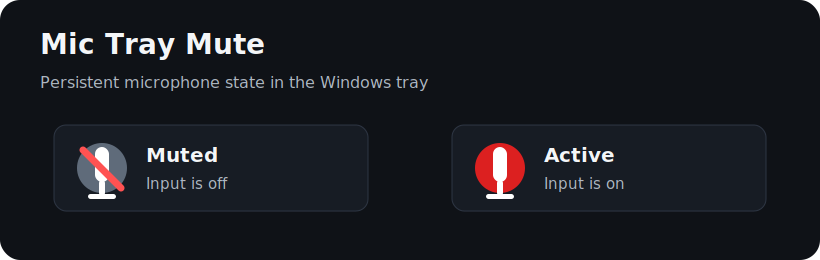

# Mic Tray Mute

Small Windows tray app for muting and unmuting the current communications microphone.

It is useful when you want a persistent microphone status indicator in the system tray and a simple global hotkey for toggling mute. The app is hardware-agnostic: it works with any microphone and any keyboard, mouse, macro pad, Stream Deck, or automation tool that can send a keyboard shortcut.



## Features

- Runs in the Windows system tray.
- Shows microphone state through the tray icon:
  - gray crossed icon = muted,
  - red icon = active.
- Registers global `Ctrl + Alt + M`.
- Double-clicking the tray icon toggles mute.
- Right-clicking the tray icon opens a small menu.
- Mutes the microphone automatically on startup.
- Shows a Windows notification when the state changes.
- Uses Windows Core Audio API directly through COM interop.
- Mutes all active recording devices by default, so apps using a non-default microphone are covered too.
- No hardware vendor dependency.

## Recommended Setup

For the best day-to-day experience:

1. Start the app automatically with Windows.
2. Keep the tray icon always visible.
3. Optionally map a keyboard or macro key to `Ctrl + Alt + M`.

That gives you a persistent visual microphone state next to the system clock and a quick physical toggle.

## Requirements

- Windows 10 or Windows 11.
- .NET 8 runtime to run.
- .NET 8 SDK to build from source.

## Download

For now, build from source with the commands below. Release binaries can be published from GitHub Releases later.

## Build

```powershell
git clone https://github.com/FEENGNEEF/MicTrayMute.git
cd MicTrayMute
dotnet build -c Release
```

The executable is created under:

```text
bin\Release\net8.0-windows\MicTrayMute.exe
```

## Run

```powershell
.\bin\Release\net8.0-windows\MicTrayMute.exe
```

The app starts in the tray and immediately mutes the microphone.

## Start With Windows

Create a shortcut to:

```text
<repo>\bin\Release\net8.0-windows\MicTrayMute.exe
```

Place the shortcut into:

```text
shell:startup
```

You can open that folder by pressing `Win + R`, typing `shell:startup`, and confirming.

## Keep The Tray Icon Visible

Windows decides whether tray icons stay visible or go into the hidden overflow menu.

On Windows 11:

1. Open **Settings**.
2. Go to **Personalization** -> **Taskbar**.
3. Open **Other system tray icons**.
4. Enable **MicTrayMute**.

On Windows 10, click the small tray arrow and drag the MicTrayMute icon down next to the volume/date area.

This is recommended, because the tray icon is the app's main status indicator.

Mic Tray Mute also has a tray menu item named **Open taskbar icon settings**, which opens the relevant Windows Settings page.

### Can the app pin itself automatically?

Not through a stable supported Windows API. Tray icon visibility is intentionally controlled by the user through Windows taskbar settings. Installers can open the taskbar settings page after installation, but they should not silently force the icon into the visible tray area through undocumented registry changes.

## Hotkey

The app listens for:

```text
Ctrl + Alt + M
```

You can trigger that shortcut from any keyboard, macro pad, mouse software, Stream Deck, or automation tool.

If another app already uses `Ctrl + Alt + M`, Mic Tray Mute will show a startup notification that the hotkey could not be registered. The tray icon and double-click toggle still work.

## Settings

Settings are stored after first run here:

```text
%APPDATA%\MicTrayMute\settings.json
```

Default settings:

```json
{
  "DeviceNameContains": "",
  "MuteAllCaptureDevices": true,
  "PreferDefaultCaptureDevice": true,
  "IsMuted": true,
  "ShowNotifications": true,
  "FallbackToDefaultCaptureDevice": true
}
```

With `MuteAllCaptureDevices` enabled, the app controls every active Windows recording device. This is the safest default for apps such as Discord that may use a specific microphone instead of the Windows default.

If you want to control only the default Windows communications recording device, set:

```json
{
  "MuteAllCaptureDevices": false,
  "PreferDefaultCaptureDevice": true
}
```

If you want to target a specific microphone by name, set:

```json
{
  "DeviceNameContains": "Your microphone name",
  "MuteAllCaptureDevices": false,
  "PreferDefaultCaptureDevice": false,
  "FallbackToDefaultCaptureDevice": false
}
```

## Privacy

Mic Tray Mute does not record audio, inspect audio streams, send telemetry, or use the network. It only calls the Windows Core Audio endpoint mute API.

## Limitations

- The app toggles the Windows endpoint mute state. Apps with their own independent mute button may show a separate mute state.
- By default, the app controls all active Windows recording devices. You can switch to default-device or name-based targeting in settings.
- The app must be running for the tray indicator and hotkey to work.
- Windows does not provide a supported API for apps to force their tray icon into the always-visible taskbar area.

## License

MIT
